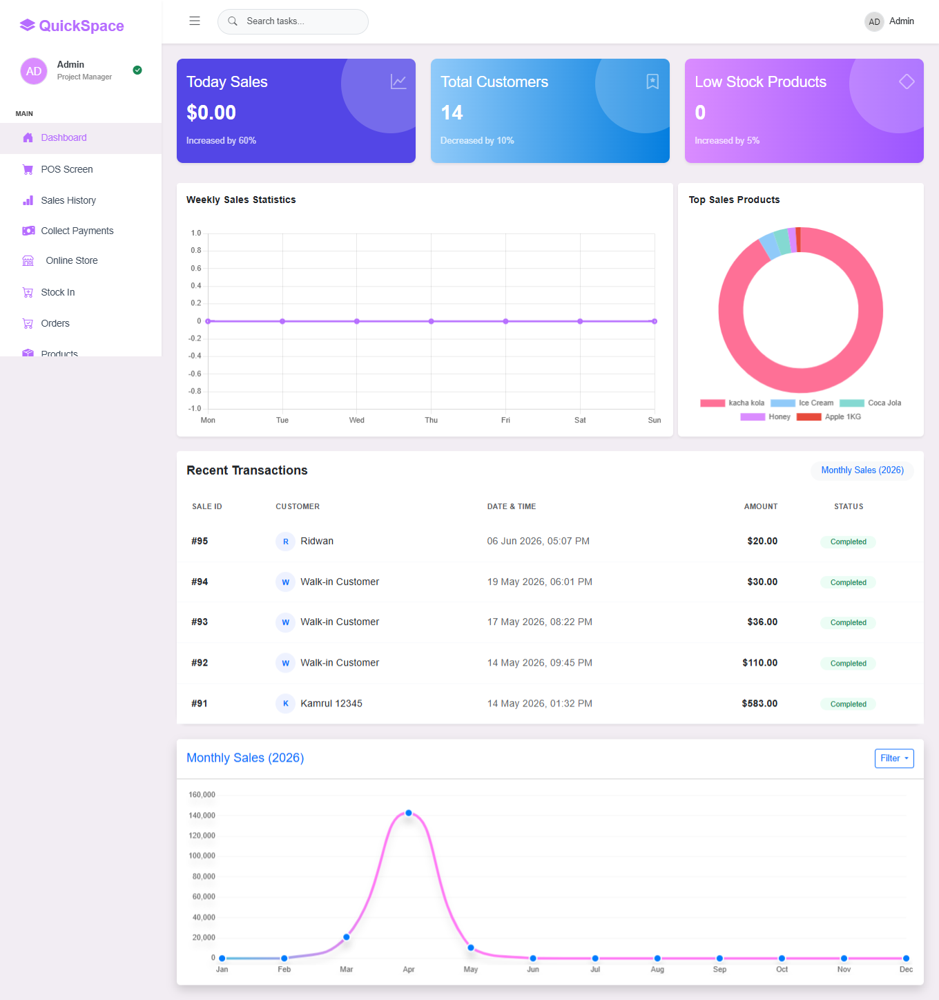

# 🛒 Quickspace POS — Inventory & E-Commerce Management System (Laravel + Livewire)

A modern, full-stack inventory and point-of-sale (POS) e-commerce application built with **Laravel**, **Livewire**, and **Alpine.js**. This system is engineered to handle seamless checkout flows, real-time sales metrics, stock purchasing tracking, and automated reporting.
---

## 👨‍💻 Developed By

* ** Developer:** Kamrul Hasan
* **LinkedIn Profile:** [linkedin.com/in/kamrul-wpdev](https://www.linkedin.com/in/kamrul-wpdev/)

---

## 🌐 Live Demo

You can test the application live in your browser using the following credentials:

* **Demo Link:** [https://quickspace.shopilax.com/login](https://quickspace.shopilax.com/login)
* **Admin Username:** `admin@pos.com`
* **Admin Password:** `12121212`

---

## 📸 Application Screenshots

### Main Dashboard Overview
Provides real-time analytics on daily sales, total customers, stock alerts, and deep data visualizations for weekly and monthly progress.


### Terminal Manager (POS Screen)
An intuitive interface for processing orders, managing customer selections, updating quantities, applying manual discounts, and handling checkouts on the fly.


---

## 🚀 Features

* **Point of Sale (POS) Terminal:** Fast, interactive terminal interface for managing baskets and quick checkout pipelines.
* **Product Management:** Seamless product entry, categorizations, and catalog management.
* **Stock & Purchase Tracking:** Keep an eye on stock levels, incoming stock entry, and purchase histories.
* **Sales & Reporting:** * Real-time graphical sales charts and statistics.
  * Comprehensive historical transactional sales reports.
* **PDF Generation:** Built-in PDF exporting for order recipes, payment receipts, and sale receipts.
* **Shop & User Management:** Dedicated shop front-end features and administrative user tier permissions.

---

## 🛠️ Tech Stack

* **Backend:** PHP 8.x, Laravel 10.x/11.x
* **Frontend:** Livewire, Blade, Tailwind CSS / Vite
* **Database:** MySQL / MariaDB

---

## ⚙️ Installation Guide (How to Run Locally)

Follow these steps to set up and run a copy of this project on your local machine:

### Prerequisites
Ensure you have the following installed on your computer:
* **PHP** (8.2 or higher recommended)
* **Composer** (PHP Package Manager)
* **Node.js & NPM** (For frontend assets)
* **MySQL** or any database server (like XAMPP/Laragon)

### 1. Clone the Repository
Open your terminal/command prompt and run:
```bash
git clone [https://github.com/Kamrulwpdev/inventory-laravel-project.git](https://github.com/Kamrulwpdev/inventory-laravel-project.git)
cd inventory-laravel-project


---

## 📜 License

MIT License

Copyright (c) 2026 Kamrul Hasan (kamrul.wpdev)

Permission is hereby granted, free of charge, to any person obtaining a copy
of this software and associated documentation files (the "Software"), to deal
in the Software without restriction, including without limitation the rights
to use, copy, modify, merge, publish, distribute, sublicense, and/or sell
copies of the Software, and to permit persons to whom the Software is
furnished to do so, subject to the following conditions:

The above copyright notice and this permission notice shall be included in all
copies or substantial portions of the Software.

THE SOFTWARE IS PROVIDED "AS IS", WITHOUT WARRANTY OF ANY KIND, EXPRESS OR
IMPLIED, INCLUDING BUT NOT LIMITED TO THE WARRANTIES OF MERCHANTABILITY,
FITNESS FOR A PARTICULAR PURPOSE AND NONINFRINGEMENT. IN NO EVENT SHALL THE
AUTHORS OR COPYRIGHT HOLDERS BE LIABLE FOR ANY CLAIM, DAMAGES OR OTHER
LIABILITY, WHETHER IN AN ACTION OF CONTRACT, TORT OR OTHERWISE, ARISING FROM,
OUT OF OR IN CONNECTION WITH THE SOFTWARE OR THE USE OR OTHER DEALINGS IN THE
SOFTWARE.
